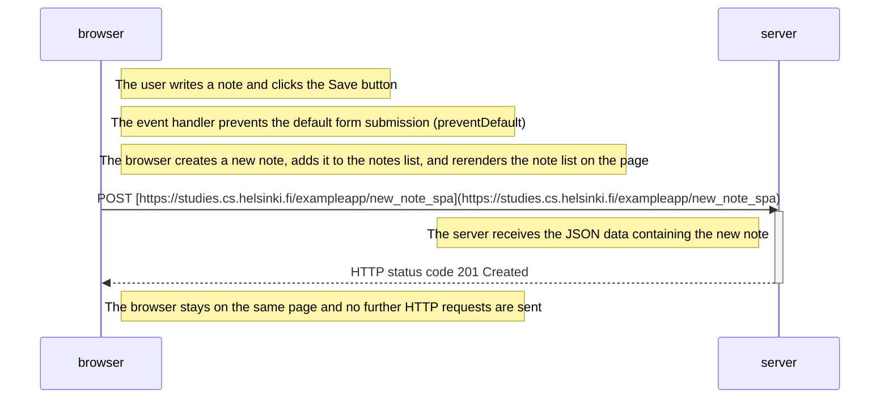

```mermaid
sequenceDiagram
    participant browser
    participant server

    Note right of browser: The user writes a note and clicks the Save button

    Note right of browser: The event handler prevents the default form submission (preventDefault)

    Note right of browser: The browser creates a new note, adds it to the notes list, and rerenders the note list on the page

    browser->>server: POST [https://studies.cs.helsinki.fi/exampleapp/new_note_spa](https://studies.cs.helsinki.fi/exampleapp/new_note_spa)
    activate server
    Note left of server: The server receives the JSON data containing the new note
    server-->>browser: HTTP status code 201 Created
    deactivate server

    Note right of browser: The browser stays on the same page and no further HTTP requests are sent
```